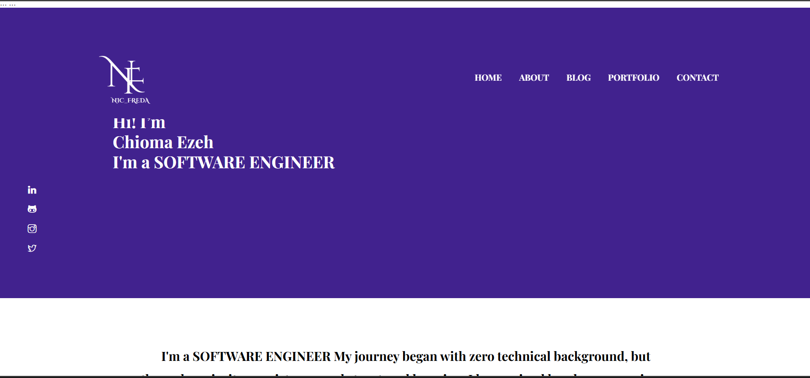
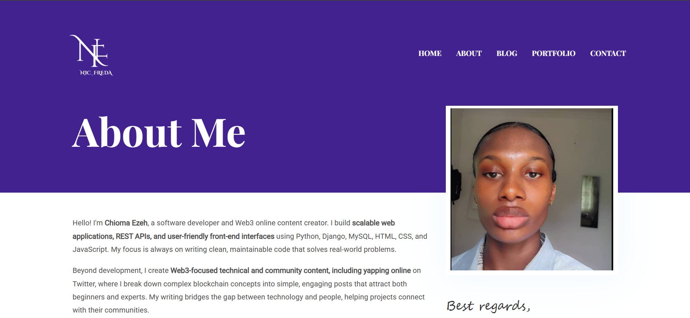
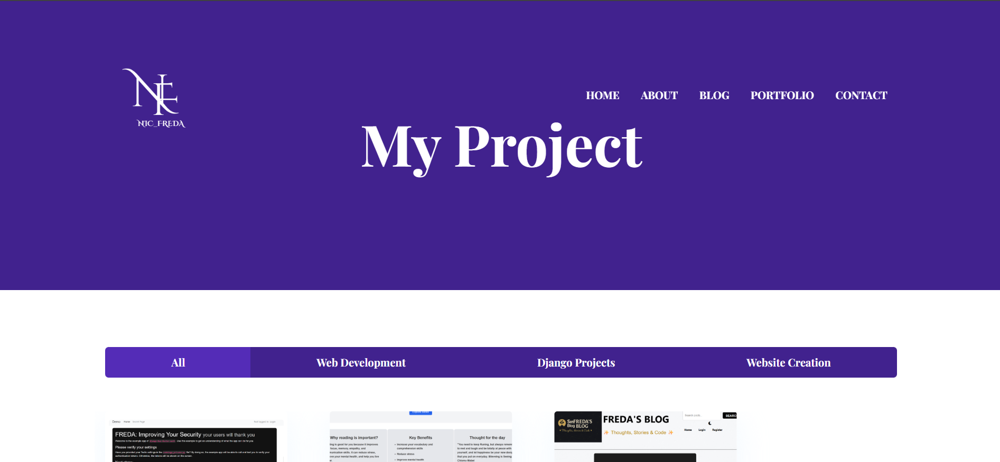
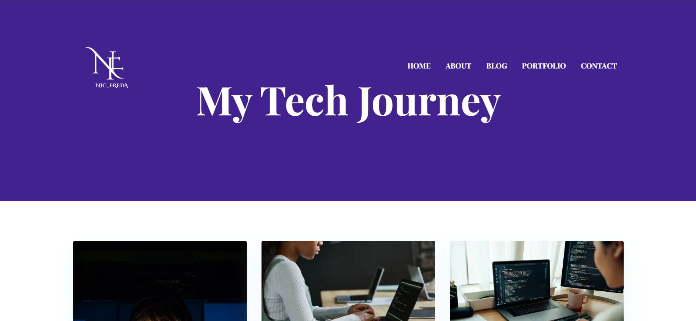
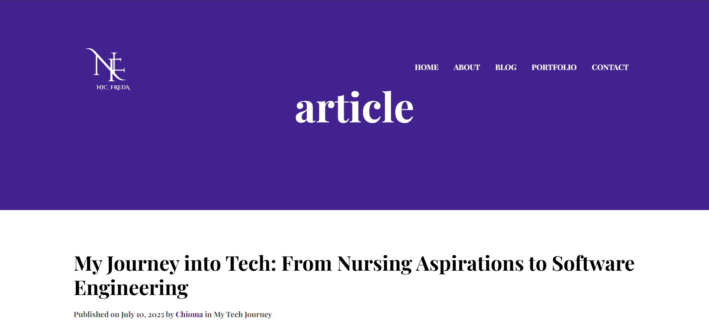
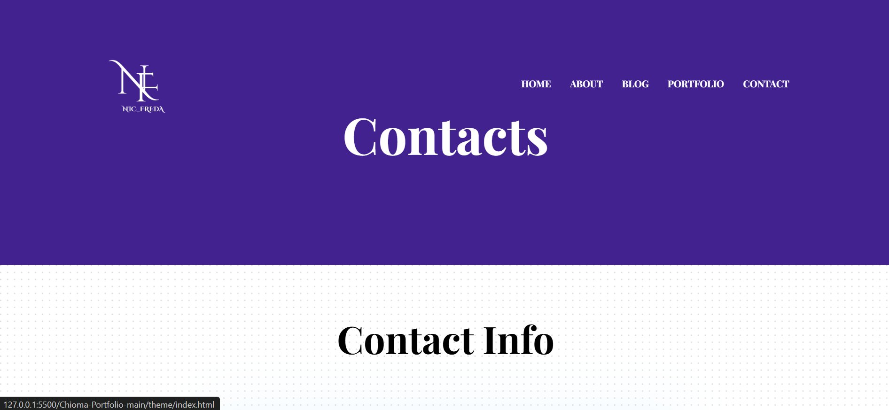

# Chioma Ezeh Portfolio

Welcome to my personal portfolio website! This is a modern, creative, and professional showcase of my skills, projects, and growth in web development, UI/UX design, and web3 content creation.  

This portfolio highlights my journey as a web developer and demonstrates my ability to build responsive, interactive websites.

---

## Live Portfolio

Check out my live portfolio here: [Chioma Portfolio](https://nicole9-sky.github.io/Chioma-Portfolio/)

---

## Example Site

| [](http://127.0.0.1:5500/Chioma-Portfolio-main/theme/index.html) | [](http://127.0.0.1:5500/Chioma-Portfolio-main/theme/about.html) | [](http://127.0.0.1:5500/Chioma-Portfolio-main/theme/portfolio.html) |
|:---:|:---:|:---:|
| **Home**  | **About**  | **Portfolio** |
| [](http://127.0.0.1:5500/Chioma-Portfolio-main/theme/blog.html) | [](http://127.0.0.1:5500/Chioma-Portfolio-main/theme/blog-single.html) | [](http://127.0.0.1:5500/Chioma-Portfolio-main/theme/contact.html) |
| **Blog** | **Blog Details** | **Contact** |

👉🏻[View Live Preview](https://demo.themefisher.com/kross/)


## Pages

* **Homepage** – Overview of me, skills, and highlights of my portfolio.  
* **About** – Detailed introduction about my background, skills, and journey into tech.  
* **Portfolio** – Showcases all my projects with interactive filtering and project descriptions.  
* **Blog** – Collection of articles and tutorials on web development and web3.  
* **Blog Details** – Individual blog posts with detailed content.  
* **Contact** – Contact form to reach me directly for collaboration, job opportunities, or mentorship.

---
## Portfolio Projects

Here are some of the projects featured in my portfolio:

1. **Two-Factor Authentication Web App** – A secure Django web application implementing two-factor authentication, user login security, and role-based access control.  
   Live Demo: [View Project](https://django-two-factor-auth-1.onrender.com/)  

2. **Library Management Website** – A Django-based system to manage books and library users efficiently with an intuitive interface.  
   GitHub: [View Project](https://github.com/Nicole9-Sky/Library-Management-Website.git)  

3. **Django Blog Project** – A responsive blog platform built using Django with user authentication, post management, and clean UI.  
   GitHub: [View Project](https://github.com/Nicole9-Sky/django_blog.git)  

4. **UI/UX Designs & Branding** – Creative designs for web applications, logos, and branding projects.  

5. **Web3 Content Creation Projects** – Informative content explaining blockchain and web3 topics.  

6. **Portfolio Website** – My personal portfolio showcasing all projects and achievements in a single responsive site.  

*(Additional projects are included in the live portfolio.)*

---

#### Install prerequisites (once for a machine)

* **Node Installation:** [Install node js](https://nodejs.org/en/download/)
* **Gulp Installation:** Install gulp globally from your terminal

```
npm install --global gulp-cli
```

Or visit the original [Gulp docs](https://gulpjs.com/docs/en/getting-started/quick-start)

#### Local setup

After successfully installing those dependencies, open this theme with any IDE [[VS Code](https://code.visualstudio.com/) recommended], and then open the internal terminal of IDM [vs code shortcut <code>ctrl/cmd+\`</code>]


## Features

- Fully **responsive design** built with **HTML5**, **CSS3**, **Bootstrap 5**, and **JavaScript**  
- **Interactive portfolio section** with project filtering and hover effects  
- **Blog section** to demonstrate knowledge and tutorials in tech and web3  
- **Contact form** integrated for direct communication  
- Optimized for **performance** and **SEO-friendly**  
- Modern and clean **UI/UX design**

---

* Install dependencies

```
npm install
```

* Run locally

```
npm run dev
```

After that, it will open up a preview of the template in your default browser, watch for changes to source files, and live reload the browser when changes are saved.

#### Production Build

After finishing all the customization, you can create a production build by running this command.

```
npm run build

<!-- licence -->
## License

## Installation

You can run this project locally to preview or edit it.

### Clone the repository

```bash
git clone https://github.com/Nicole9-Sky/Chioma-Portfolio.git

<!-- resources -->
## Resources

Some third-party plugins that we used to build this template. Please check their license.

* **Bootstrap v4.5**: <https://getbootstrap.com/docs/4.5/getting-started/introduction/>
* **Jquery v3.5.1**: <https://jquery.com/download/>
* **Google Fonts**: <http://fonts.google.com/>
* **Themify Icons**: <https://themify.me/themify-icons/>
* **Slick**: <https://kenwheeler.github.io/slick/>
* **Shuffle**: <https://vestride.github.io/Shuffle/>
